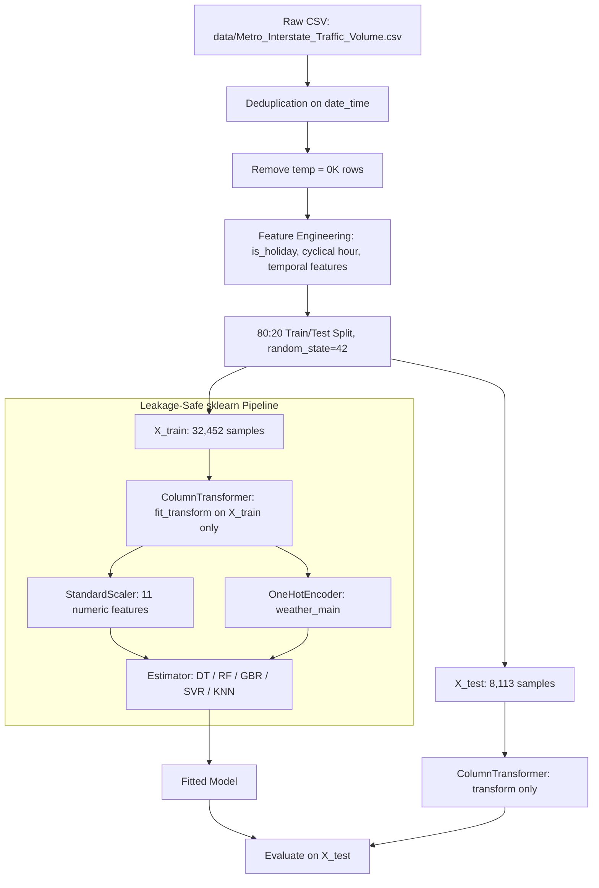

<div align="center">

# 23CSE301 — Machine Learning Capstone | Review 1

**Non-Linear Regression on Metro Interstate Traffic Volume**

[](https://www.python.org/)
[](https://scikit-learn.org/)
[](https://numpy.org/)
[](https://pandas.pydata.org/)
[]()

[Overview](#1-project-overview) &nbsp;|&nbsp;
[Dataset](#2-dataset) &nbsp;|&nbsp;
[Feature Engineering](#3-feature-engineering) &nbsp;|&nbsp;
[Pipeline Architecture](#4-pipeline-architecture) &nbsp;|&nbsp;
[Algorithms](#5-algorithms-implemented) &nbsp;|&nbsp;
[Results](#6-results-and-benchmarks) &nbsp;|&nbsp;
[Repository Structure](#7-repository-structure) &nbsp;|&nbsp;
[Quick Start](#8-installation-and-quick-start)

---

</div>

## 1. Project Overview

This sub-section of the **23CSE301 Machine Learning Capstone (Review 1)** implements five non-linear regression algorithms on the UCI Metro Interstate Traffic Volume dataset, predicting hourly westbound traffic volume on the I-94 Minnesota corridor.

This work is one part of a larger team capstone project. The shared pipeline contract (preprocessing steps, split strategy, leakage guard) is designed to be consistent with the rest of the team's regression and classification notebooks so that results can be compared and merged.

**Scope of this sub-section:**

| Property | Value |
| :--- | :--- |
| Task | Supervised Regression |
| Dataset | UCI Metro Interstate Traffic Volume |
| Target Variable | `traffic_volume` — Hourly vehicle count (vehicles/hr) |
| Algorithms | Decision Tree, Random Forest, Gradient Boosting, SVR, KNN |
| Evaluation | R2 Score, RMSE, MAE, 5-Fold Cross-Validation (top 2 models) |
| Notebook | `notebooks/regression.ipynb` |

---

## 2. Dataset

**Source:** [UCI ML Repository — Dataset #492: Metro Interstate Traffic Volume](https://archive.ics.uci.edu/dataset/492/metro+interstate+traffic+volume)

**File:** `data/Metro_Interstate_Traffic_Volume.csv`

**Description:** Hourly westbound traffic volume records on I-94 at ATR station 301 near Minneapolis-St. Paul, MN, collected from 2012 to 2018. Weather and holiday conditions are included as contextual features.

### Raw Columns

| Column | Type | Description |
| :--- | :--- | :--- |
| `holiday` | Categorical | US national holiday or MN State Fair label; `NaN` on regular days |
| `temp` | Numeric (K) | Atmospheric temperature in Kelvin |
| `rain_1h` | Numeric (mm) | Millimetres of rainfall in the past hour |
| `snow_1h` | Numeric (mm) | Millimetres of snowfall in the past hour |
| `clouds_all` | Numeric (%) | Percentage of cloud coverage |
| `weather_main` | Categorical | Short weather description (e.g., Clear, Clouds, Rain) |
| `weather_description` | Categorical | Verbose weather description (excluded — redundant with `weather_main`) |
| `date_time` | Datetime | Hourly timestamp of the observation |
| `traffic_volume` | Numeric | **Target:** Westbound hourly vehicle count (0 to ~7,280) |

### Data Cleaning

Two quality issues were identified and corrected before any modeling:

1. **Duplicate Hourly Records:** The raw file contains 48,204 rows but multiple duplicate `date_time` entries exist (same hour logged more than once). All duplicates were removed using a keep-first strategy on `date_time`, reducing the dataset to 40,575 unique hourly records.

2. **Impossible Temperature Values:** 10 rows contain `temp = 0 K` (-273.15 C), which is a physical impossibility representing sensor failures. These rows were removed. Final clean dataset: **40,565 rows**.

### Train/Test Split

| Partition | Rows | Percentage |
| :--- | :---: | :---: |
| Training Set (`X_train`) | 32,452 | 80% |
| Test Set (`X_test`) | 8,113 | 20% |

Split parameters: `test_size=0.2`, `random_state=42`. The same fixed split is used across all five models to ensure a fair comparison.

---

## 3. Feature Engineering

Six additional features were derived from the raw columns before model training:

| Feature | Derivation | Purpose |
| :--- | :--- | :--- |
| `is_holiday` | 1 if `holiday` is not NaN, else 0 | Binary indicator; replaces the text holiday column |
| `hour` | `date_time.dt.hour` | Raw hour of day (0--23) |
| `day_of_week` | `date_time.dt.dayofweek` | Day index (0 = Monday, 6 = Sunday) |
| `month` | `date_time.dt.month` | Month index (1--12) |
| `is_weekend` | 1 if `day_of_week` in {5, 6}, else 0 | Binary weekend indicator |
| `hour_sin` | sin(2 * pi * hour / 24) | Cyclical hour encoding — sine component |
| `hour_cos` | cos(2 * pi * hour / 24) | Cyclical hour encoding — cosine component |

**Why cyclical encoding for hour?**
A raw integer 0--23 creates an artificial discontinuity: hour 23 and hour 0 appear maximally distant despite being one hour apart. The sine/cosine transformation maps the 24-hour cycle onto a unit circle, ensuring continuity at midnight.

**Final feature set used for modeling:**

- Numeric: `temp`, `rain_1h`, `snow_1h`, `clouds_all`, `hour`, `day_of_week`, `month`, `is_holiday`, `is_weekend`, `hour_sin`, `hour_cos`
- Categorical (one-hot encoded): `weather_main`

---

## 4. Pipeline Architecture

> [!IMPORTANT]
> All preprocessing transformers are fitted **exclusively on `X_train`**. The held-out test set `X_test` is only transformed (never fitted), guaranteeing zero data leakage.



---

## 5. Algorithms Implemented

Five non-linear regression algorithms are implemented and evaluated in `notebooks/regression.ipynb`:

### Decision Tree Regressor

Recursively partitions feature space by selecting the feature and threshold that minimizes weighted child variance (MSE-equivalent split criterion). Depth and minimum sample constraints control overfitting.

Key hyperparameters tuned: `max_depth`, `min_samples_split`, `min_samples_leaf`.

### Random Forest Regressor

Bootstrap ensemble of decision trees. Each tree is trained on a random sample (with replacement) of the training data and a random subset of features at each split. Final prediction is the arithmetic mean across all trees.

Key hyperparameters tuned: `n_estimators`, `max_depth`, `max_features`.

### Gradient Boosting Regressor

Sequentially fits shallow trees to the residual errors of the current ensemble. Each new tree corrects the mistakes of all previous trees. The learning rate (shrinkage) controls the step size in function space.

Key hyperparameters tuned: `n_estimators`, `learning_rate`, `max_depth`.

### Support Vector Regressor (SVR)

Fits a hyperplane within an epsilon-insensitive tube around the training data using a radial basis function (RBF) kernel. Predictions are made by support vectors — training points outside the tube. Sensitive to feature scale; requires `StandardScaler`.

Key hyperparameters tuned: `C`, `epsilon`, `gamma` (via RBF kernel).

### K-Nearest Neighbors Regressor (KNN)

Predicts by averaging the target values of the k training points closest to the query point under Euclidean distance. Non-parametric; no explicit training phase. Sensitive to feature scale; requires `StandardScaler`.

Key hyperparameter tuned: `n_neighbors`.

---

## 6. Results and Benchmarks

All five models are evaluated on the held-out test set of **8,113 samples**, ranked by test R2 score descending. The top 2 models also include 5-fold cross-validation.

| Rank | Algorithm | Test R2 | RMSE (veh/hr) | MAE (veh/hr) | 5-Fold CV R2 | Key Hyperparameters |
| :---: | :--- | :---: | :---: | :---: | :---: | :--- |
| 1 | **Gradient Boosting Regressor** | **0.9460** | **459.26** | **275.48** | 0.9437 +/- 0.0019 | `lr=0.2`, `n_estimators=200`, `max_depth=4` |
| 2 | **Random Forest Regressor** | **0.9454** | **461.74** | **266.93** | 0.9413 +/- 0.0016 | `n_estimators=100`, `max_depth=10` |
| 3 | Decision Tree Regressor | 0.9396 | 485.70 | 284.42 | — | `max_depth=8` |
| 4 | K-Nearest Neighbors (KNN) | 0.9286 | 528.02 | 338.88 | — | `n_neighbors=9` |
| 5 | Support Vector Regressor | 0.8261 | 824.15 | 555.43 | — | `kernel='rbf'`, `C=50.0` |

### Key Analytical Observations

**Why ensemble methods lead:** Gradient Boosting and Random Forest both capture the bimodal, non-linear 24-hour traffic distribution (morning and evening commuter peaks) without manual feature engineering for peak periods. Bagging and boosting independently reduce prediction variance, the dominant error source in hourly traffic data.

**SVR performance:** The default `C=1.0` severely over-regularizes SVR, yielding a baseline R2 of only 0.18. Tuning to `C=50.0` recovers an R2 of 0.8261 (+0.6447 improvement), demonstrating how critical regularization strength is for SVR on large-scale datasets.

**KNN with scaling:** Without `StandardScaler`, `temp` in Kelvin (range ~250--310) dominates Euclidean distances over binary features. Standardizing all features allows KNN to find genuinely meaningful neighbors.

**Feature importances:** Across all tree-based models, `hour`, `hour_sin`, `hour_cos`, and `day_of_week` account for the majority of variance reduction, confirming that daily commuter timing is the primary driver of traffic volume — not weather conditions.

---

## 7. Repository Structure

```text
ml_capstone/
|
├── README.md                               # This file
├── requirements.txt                        # Version-pinned Python dependencies
├── .gitignore
|
├── data/
│   └── Metro_Interstate_Traffic_Volume.csv # UCI Dataset #492 (40,565 clean rows)
|
├── models/                                 # Serialized model artifacts (optional)
|
└── notebooks/
    └── regression.ipynb                    # Full 5-model regression pipeline
                                            # Includes: EDA, preprocessing, training,
                                            # hyperparameter tuning, CV, visualizations
```

---

## 8. Installation and Quick Start

### Prerequisites

- Python 3.10 or higher (tested on 3.12)
- pip 23+

### Step 1 — Clone and Enter the Repository

```bash
git clone https://github.com/Dakshin10/ml_capstone.git
cd ml_capstone
```

### Step 2 — Create a Virtual Environment

```bash
# Windows
python -m venv .venv
.venv\Scripts\activate

# macOS / Linux
python3 -m venv .venv
source .venv/bin/activate
```

### Step 3 — Install Dependencies

```bash
pip install -r requirements.txt
```

| Package | Minimum Version | Purpose |
| :--- | :---: | :--- |
| `numpy` | 1.24.0 | Numerical computation |
| `pandas` | 2.0.0 | Data loading and feature engineering |
| `matplotlib` | 3.7.0 | Static plots and charts |
| `seaborn` | 0.12.0 | Statistical visualization |
| `scikit-learn` | 1.2.0 | Preprocessing, models, metrics |
| `jupyter` | 1.0.0 | Notebook server |
| `ipykernel` | 6.0.0 | Python kernel for VS Code / JupyterLab |

> [!NOTE]
> scikit-learn 1.2+ is required. Earlier versions use the deprecated `OneHotEncoder(sparse=False)` parameter; this codebase uses `sparse_output=False`.

### Step 4 — Open the Notebook

**Jupyter:**
```bash
jupyter notebook
```
Navigate to `notebooks/regression.ipynb` and select **Kernel -> Restart and Run All**.

**VS Code:**
1. Open `notebooks/regression.ipynb`
2. Click the kernel selector (top-right corner)
3. Select the Python interpreter from `.venv` inside this project directory
4. Click **Run All**

> [!WARNING]
> If `d:\venv` appears in the kernel list, do not select it. That environment belongs to a separate project and is missing the required ML packages. Always use `.venv` created inside this project directory, or a system Python installation where numpy, pandas, sklearn, and matplotlib are confirmed installed.

---

## 9. Reproducibility

All stochastic operations use `random_state=42`:

- `train_test_split(random_state=42)` — identical partitions across runs
- `RandomForestRegressor(random_state=42)` — deterministic bootstrap sampling
- `GradientBoostingRegressor(random_state=42)` — deterministic feature subsampling

Running `notebooks/regression.ipynb` from top to bottom reproduces the exact metric values in section 6.

---

<div align="center">

B.Tech Computer Science and Engineering &nbsp;|&nbsp; 23CSE301 Machine Learning Capstone &nbsp;|&nbsp; Review 1

</div>
